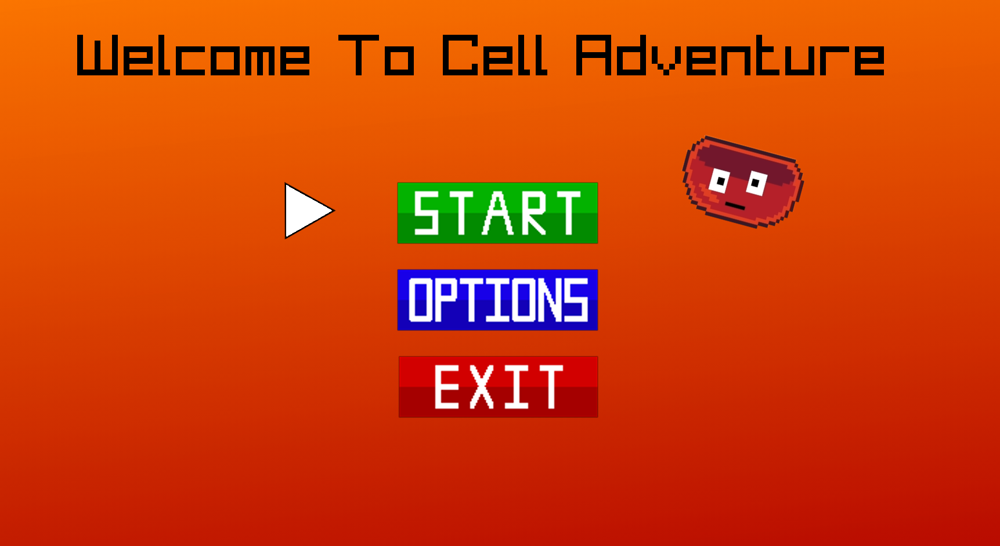
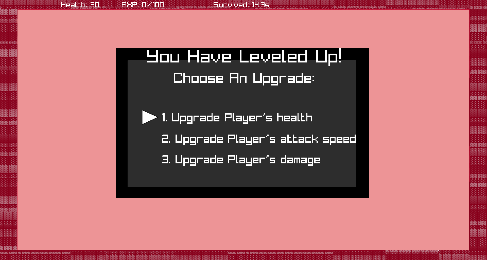

<div align="center"> </div>
<div align="center">


</div>

##  About
<p>
   The idea of our game is to educate the player on both biology and chemistry. The cell and viruses help to learn the cells in the human body and the questions help to learn the chemical elements.
</p>

##  Demo of our project
<div align = "center">
  
  
</div>

##  Installing
You can install our project by using this link:
```
   https://github.com/INNedkova21/The_innovative_innovators.git
```


##    Team members
1. Iva Nedkova - ***Scrum trainer***
   > Email: ***INNedkova21@codingburgas.bg***
   
2. Bozhidar Dukov - ***Back-end Developer***
   > Email: ***BNDukov21@codingburgas.bg***

3. Todor Ivanov - ***Back-end Developer***
   > Email: ***TPIvanov21@codingburgas.bg***

4. Daniel Stefanov - ***Designer***
   > Email: ***DCStefanov21@codingburgas.bg***


##  Used technologies:
-   C++
-  C
-   Visual studio
-   Git Hub
-   Git
-   Power point
-   Word
-   Excel
-   Figma
-   Piskel


